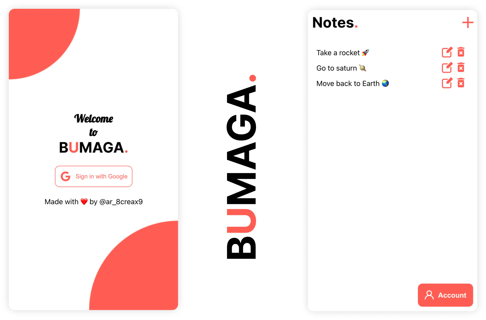

# BUMAGA NOTES APPLICATION (React,Firebase and Redux)
[Link to website](https://bumago-notes-application.web.app/)

<h1 align="center">Built With</h1>
<p align="center">
  <a href="https://firebase.google.com/" target="_blank"></a> 
  <a href="https://reactjs.org/" target="_blank">  </a> 
  <a href="https://redux.js.org" target="_blank">  </a> 
</p>

### What is this About ?
This is a simple notes application which uses firebase for authentication and storing the user data.

<p align="center">
  </img>
</p>

## How to Use the Code
* To Clone the repo run the command given below:
```sh 
git clone https://github.com/{your_user_name}/Font_KNIGA.git
```
* Go to the folder and install npm using this command
```sh
npm install
```
* Now run
```sh
npm start
```


## Features
* Google Sign In using firebase
* Firebase Firestore database
* Easy Interface

[Link to Website](https://bumago-notes-application.web.app/)
